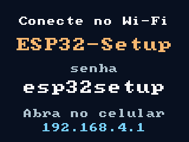
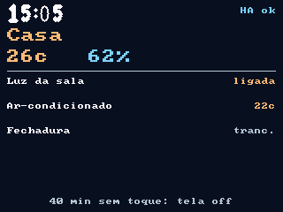
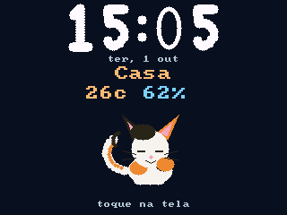
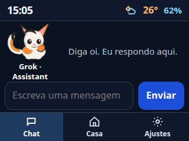
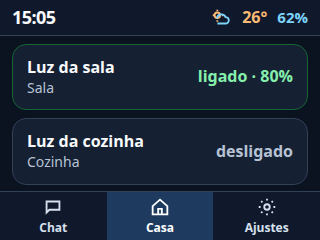

# Guia do firmware ESP32 + CYD

Este documento explica o que o firmware faz, como as telas se comportam e como
ligar o painel amarelo (Cheap Yellow Display 2.8") a um Home Assistant na rede
local.

## O que é

Firmware para **ESP32** (ESP-IDF) que:

1. Entra na rede Wi-Fi salva ou sobe o portal `ESP32-Setup` no primeiro uso.
2. Serve um app web no celular (chat, Casa, Ajustes).
3. No **CYD 2.8"** (ESP32-2432S028, ILI9341 + XPT2046), desenha no próprio painel
   uma interface de observação com dados do Home Assistant.

Placa alvo do painel: **só a amarela de 2.8"**. A de 3.5" usa outro controlador
e não acende com esta imagem.

## Telas do painel

### Portal (sem Wi-Fi de casa)

Enquanto a placa não tem IP de estação, o painel mostra como conectar o celular:



1. Entre no Wi-Fi `ESP32-Setup`, senha `esp32setup`.
2. Abra `http://192.168.4.1`.
3. Salve a rede de casa e, no onboarding, o Home Assistant.

### Observação (conectado ao HA)

Depois que a estação ganha IP, o firmware consulta
`http://<endereço-do-HA>/api/states` com o token longo (Bearer) e monta a tela:



- Hora e status (`HA ok`, `offline`, `sem hub`, …).
- Lugar (Casa), temperatura e umidade quando existem no HA.
- Até quatro dispositivos (luzes ligadas, clima, trancas, etc.).
- Rodapé: após 40 minutos sem toque a tela desliga.

### Protetor de tela

Após **30 segundos** sem toque, o relógio grande toma a tela (fonte sans
geométrica, cidade, temperatura e umidade):



Um toque volta à observação. Após **40 minutos** sem uso a backlight apaga; um
toque acorda o painel.

### App web no celular

O mesmo aparelho serve a interface touch no navegador:

| Chat | Casa |
|------|------|
|  |  |

## Home Assistant

No onboarding ou em **Ajustes** do app web:

| Campo | Valor |
|-------|--------|
| Tipo | Home Assistant |
| Endereço | `host:8123` (ex.: `192.168.0.10:8123` ou `homeassistant.local:8123`) |
| Senha | *Long-lived access token* do HA (não a senha de login) |

Como criar o token no HA: Perfil do usuário → **Long-Lived Access Tokens** →
**Create Token**. Cole o valor no campo de senha do portal.

O poller roda a cada ~30 s enquanto houver Wi-Fi. Se o hub não estiver
configurado, o painel mostra `sem hub` e pede configuração no celular.

## Tempos

| Evento | Tempo |
|--------|-------|
| Protetor (relógio grande) | 30 s sem toque |
| Tela off (backlight) | 40 min sem toque |
| Atualização do HA | ~30 s |

## Build a partir do código

Veja [INSTALACAO.md](INSTALACAO.md). Resumo:

```bash
. "$HOME/esp/esp-idf/export.sh"
idf.py -B build_cyd -DSDKCONFIG_DEFAULTS="sdkconfig.defaults;sdkconfig.cyd" build
idf.py -B build_cyd -p PORTA flash monitor
```

## Pacote pronto para gravar

A pasta [`release/cyd/`](../release/cyd/) traz os três binários já compilados e
scripts `flash.bat` / `flash.sh`. Não é preciso compilar o projeto para só
atualizar a placa.
